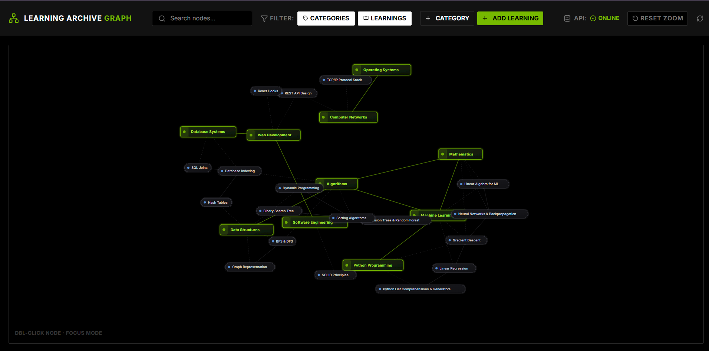
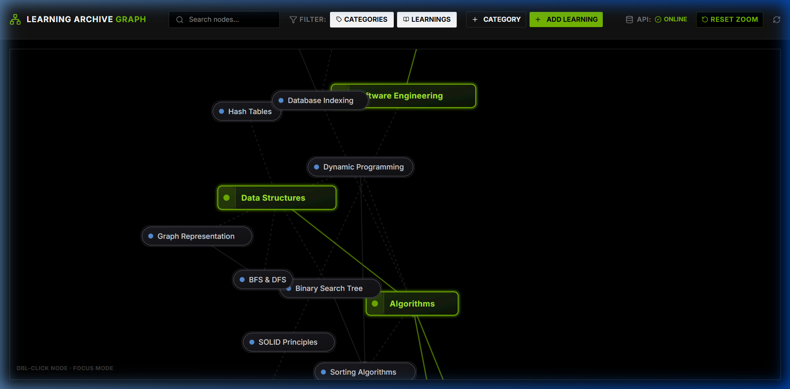
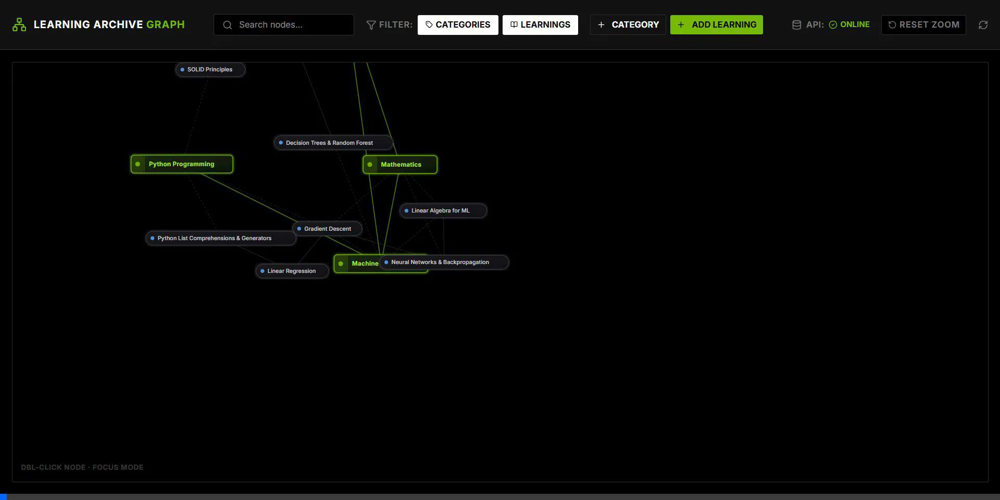

# Daily Learning Archive Knowledge Graph Dashboard

An interactive web-based dashboard and Model Context Protocol (MCP) registry for documenting daily learnings, linking them to categories, and visualizing connections dynamically. 

Built with a premium, technical dark mode aesthetic (styled with NVIDIA-green branding) and featuring full AI assistant integration.

---

## Features

- **Full-Viewport D3 Network Graph**: Fluid, force-directed graph simulation representing categories, entries, and relations.
- **Glassmorphism Detail Panel**: Slide-out overlay sidebar displaying learning notes in markdown, category listings, and interactive connection management.
- **Header Integrated Toolbar**: Compact search, node category/learning filters, and creation actions directly built into the top navigation bar.
- **Node Position Persistence**: Visual nodes remember their dragged positions, preventing them from flying or resetting when new logs are added.
- **Model Context Protocol (MCP) Server**: Exposes full CRUD graph tools directly to LLMs (Claude, ChatGPT, Gemini, Cursor, OpenClaw, etc.).

---

## Dashboard Preview

### 1. Main Dashboard View


### 2. Full Panned and Zoom Reset View


### 3. Interactive Web UI Demo


---

## Tech Stack

- **Frontend**: React, TypeScript, D3.js (simulation), Vite, Vanilla CSS.
- **Backend**: FastAPI (Python), SQLModel/SQLAlchemy (SQLite Database).
- **Deployment**: Docker & Docker Compose.
- **Protocol**: Model Context Protocol (MCP) Python SDK (`FastMCP`).

---

## Setup Instructions

### Quick Start with Docker (Recommended)
This runs both the FastAPI backend and React frontend with hot-reloading active.

```bash
# Clone the repository and navigate inside
cd belajar

# Run the containers in background
docker compose up -d --build
```
- Frontend will be accessible at: `http://localhost:5173`
- Backend API docs (Swagger) will be accessible at: `http://localhost:8000/docs`

---

### Local Development Setup

If you prefer to run services natively outside of Docker:

#### 1. Backend Setup
```bash
cd backend

# Create a virtual environment
python -m venv venv
venv\Scripts\activate  # On Linux/macOS: source venv/bin/activate

# Install requirements
pip install -r requirements.txt

# Start backend dev server
uvicorn app.main:app --reload --port 8000
```

#### 2. Frontend Setup
```bash
cd frontend

# Install packages
npm install

# Start Vite dev server
npm run dev
```
Open `http://localhost:5173` in your browser.

---

## Model Context Protocol (MCP) Integration

You can connect your local AI editor or assistant to this repository to let the AI automatically read, search, log, and link learnings for you.

The MCP server is located at the root directory in [mcp_server.py](./mcp_server.py).

### List of Exposed Tools
- `get_graph`: Fetch all graph categories, learnings, and connection links.
- `list_categories` & `add_category` & `delete_category`: Manage categories.
- `list_learnings` & `add_learning` & `update_learning` & `delete_learning`: Manage learning entries.
- `list_connections` & `add_connection` & `delete_connection`: Establish and delete links.

---

### Configuration Guides

#### 1. Claude Desktop Setup
Add the following block to your configuration file (typically `%APPDATA%\Claude\claude_desktop_config.json` on Windows or `~/Library/Application Support/Claude/claude_desktop_config.json` on macOS):

```json
{
  "mcpServers": {
    "learning-archive-graph": {
      "command": "F:/projects/belajar/backend/venv/Scripts/python.exe",
      "args": [
        "F:/projects/belajar/mcp_server.py"
      ],
      "env": {
        "API_URL": "http://localhost:8000/api"
      }
    }
  }
}
```

#### 2. OpenClaw / MCPorter Setup
OpenClaw automatically discovers local MCP servers configured via **MCPorter**. 

We have placed an auto-discovery configuration at [config/mcporter.json](./config/mcporter.json). Alternatively, register it via OpenClaw CLI:

```bash
openclaw mcp add learning-archive-graph F:/projects/belajar/backend/venv/Scripts/python.exe F:/projects/belajar/mcp_server.py
```

#### 3. Cursor Setup
Navigate to **Cursor Settings > Models > MCP > Add New MCP Server**:
- **Name**: `learning-archive-graph`
- **Type**: `command`
- **Command**: `F:/projects/belajar/backend/venv/Scripts/python.exe F:/projects/belajar/mcp_server.py`
